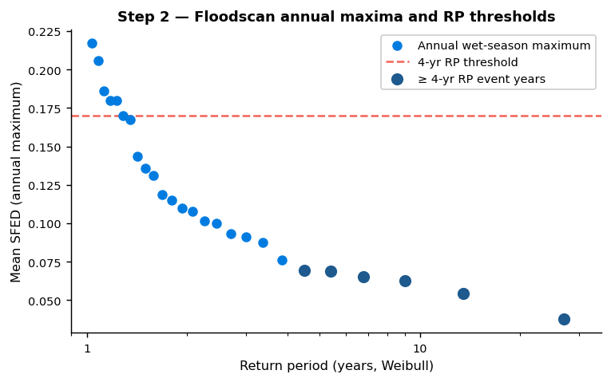
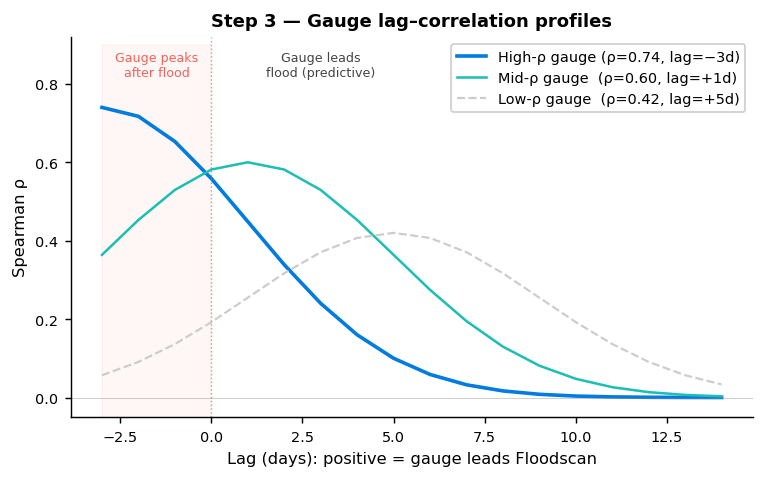
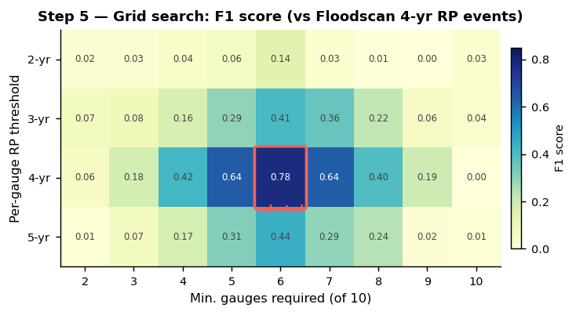
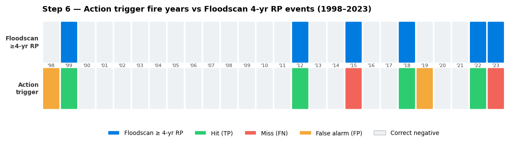
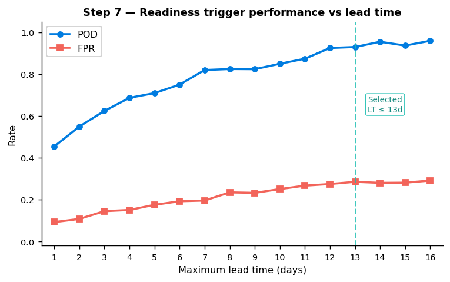

# Methodology Reference

[← Index](index.html)

---

## Overview

This workflow develops a **dual-trigger anticipatory action system** for riverine flooding, structured around two independent signals:

- **Action trigger** — fires when a sufficient fraction of upstream streamflow gauges simultaneously exceed their empirical return period threshold, as measured in the Google Flood Forecasting reanalysis and reforecast. Gauges are selected purely by forecast skill from a combined GRRR and GloFAS candidate pool; in practice all selected gauges have been GRRR for Adamawa, but a GloFAS gauge would be included if it outperformed the GRRR alternatives.
- **Readiness trigger (GloFAS)** — fires when a GloFAS ensemble reforecast at a key station exceeds a discharge threshold within a set lead time window.

The approach is data-driven and non-parametric throughout: all return periods use empirical Weibull plotting positions, and all thresholds are calibrated against satellite-derived flood observations (Floodscan SFED). This makes it directly transferable to other river systems in Nigeria where the same data sources have coverage.

---

## Analysis steps

### Step 1 — Identify candidate reporting points (`01_reporting_points`)

Starting from a set of **target LGAs** (the geographic scope of intended action), identify all Google GRRR streamflow gauges whose catchments intersect the target area. Include the GloFAS reference station for the river basin. This produces a candidate list of gauges (typically 40–50 for a state-level analysis).

**Key inputs:** target LGA p-codes, GloFAS station coordinates
**Key output:** `{state}_gauges.parquet`

---

### Step 2 — Establish flood ground truth (`02_floodscan_benchmark`)

Aggregate Floodscan SFED (Surface Fraction Exposed to Flooding) pixel values to a daily mean for the target area, restricted to a 10 km river buffer. Compute wet-season annual maxima and apply the Weibull plotting position formula:

`RP = (n + 1) / k`

where *n* is the number of years in the record and *k* is the rank of the year in ascending order of the annual maximum. This gives empirical flood-event years at 3, 4, and 5-year return periods, which serve as ground truth throughout all subsequent evaluation.

**Key inputs:** Floodscan SFED parquet (pixel-level, ~10 km river buffer), analysis period
**Key output:** annual event flags per RP level (1998–2023)

---

### Step 3 — Rank gauges by forecast skill (`03_forecast_correlation`)

For each candidate gauge, compute the Spearman rank correlation between wet-season daily streamflow and Floodscan SFED across a lag range of −3 to +14 days. Record the best (lag, correlation) pair per gauge. The lag-adjusted correlation captures how many days in advance a gauge's streamflow predicts observed flooding in the target area.

**Key inputs:** GRRR reanalysis streamflow, Floodscan SFED timeseries
**Key output:** `{state}_gauge_correlations.parquet` (ranked by best Spearman ρ)

---

### Step 4 — Select top-performing gauges (`04_gauge_selection_assessment`)

Retain the top `TOP_N` gauges (default: 10) ranked by best Spearman ρ, drawn from the combined GRRR and GloFAS candidate pool. The selection is purely performance-based: no source-level filtering is applied, and a GloFAS gauge will be selected if it outperforms the GRRR alternatives in a given context. Gauges with poor correlation are excluded regardless of data source or geographic position.

**Key inputs:** gauge correlation rankings
**Key output:** `{state}_selected_gauges.parquet`

---

### Step 5 — Grid search over trigger configurations (`05_trigger_assessment`)

For each combination of:

- **RP threshold** (per-gauge exceedance level: 2, 3, 4, or 5-year)
- **Minimum fraction of gauges** required to fire simultaneously (varied across all selected gauges)

count the years in which the trigger condition is met (≥ fraction of gauges exceed their RP threshold on the same wet-season day). Score each configuration against Floodscan event years at each RP level using POD, FAR, and F1. This grid search identifies configurations that balance detection rate against false alarms.

**Key inputs:** wet-season streamflow annual maxima, Floodscan event flags
**Key output:** `{state}_trigger_grid.parquet` (POD/FAR/F1 per configuration)

---

### Step 6 — Define and evaluate the action trigger (`06_trigger_definition`)

Fix a specific trigger configuration (RP threshold, minimum gauge count) based on the grid search results and operational considerations. Evaluate performance separately for:

- **Reanalysis period** (1998–2023): full historical record
- **Reforecast period** (2003–2022): uses operational forecast data, accounting for only those wet seasons with complete valid-time coverage through October

Report POD and false alarm rate (FAR = FP / (FP + TN)) against Floodscan 4-year RP events. The reforecast evaluation is the operationally relevant figure.

The current Adamawa configuration is **≥ 60% of 10 gauges exceed their 4-year RP threshold** (action trigger fires if ≥ 6 of 10 gauges exceed threshold on any wet-season day).

**Key inputs:** selected gauge streamflow, Floodscan event flags
**Key output:** performance table, heatmap of trigger-fire years, gauge contribution matrix

---

### Step 7 — Evaluate the GloFAS readiness trigger (`07_readiness_trigger`)

Assess a single-station GloFAS readiness trigger independently of the GRRR action trigger. For a range of lead times (1–16 days), count the years where the GloFAS ensemble mean discharge exceeds a threshold (`RP_THRESH`) at any point during the wet season. Score against Floodscan event years to identify the best lead time setting for each RP level.

The readiness trigger is designed to fire *before* the action trigger — it gives humanitarian partners advance notice that conditions are developing. The operational version uses the GloFAS ensemble reforecast (available in near-real-time) rather than reanalysis.

The current Adamawa configuration is **GloFAS ensemble mean > 3,132 m³/s at lead time ≤ 13 days**, targeting 4-year RP Floodscan events.

**Key inputs:** GloFAS reanalysis (threshold calibration), GloFAS reforecast (evaluation)
**Key output:** performance curves by lead time, best configuration per RP level

---

## Configuration levers for a new context

To apply this workflow to a different river system in Nigeria, the following parameters are the primary adapters:

| Parameter | Where set | What to change |
|---|---|---|
| `STATE` | `constants.py` | State name (e.g., `"Benue"`, `"Kogi"`) |
| `lga_pcodes` | `constants.py` | P-codes for target LGAs in the new context |
| Floodscan pixel file | `constants.py` | Path to pixel-level SFED parquet for the new area |
| GloFAS station ID | `constants.py` | Key into the GloFAS reanalysis for the nearest calibrated station |
| Google HYBAS catchments | `01_reporting_points` | Re-run with new LGA boundary to get candidate gauges |
| `WET_MONTHS` | `constants.py` | Wet season months (default `[8,9,10,11]`; may shift upstream) |
| `ANALYSIS_START_YEAR` | `constants.py` | Earliest year with Floodscan and streamflow overlap |

The notebooks are otherwise self-contained: running them in sequence from 01 through 07 with updated constants will produce a calibrated dual-trigger system for the new context. Steps 3–5 in particular (correlation ranking and grid search) require no manual intervention — they automatically identify the best-performing gauge set and threshold combination for the target area.

---

## Data sources summary

| Dataset | Coverage | Role in workflow |
|---|---|---|
| Google GRRR reanalysis | ~1980–2023 | Gauge ranking (NB 03), trigger calibration (NB 05–06) |
| Google GRRR reforecast | 2003–2022 | Operational trigger evaluation (NB 06) |
| GloFAS reanalysis (ERA5) | 1979–2023 | Readiness threshold calibration (NB 07) |
| GloFAS ensemble reforecast | 2003–2022 | Readiness trigger evaluation (NB 07) |
| Floodscan SFED | 1998–2025 | Flood ground truth throughout (NB 02–07) |
| HYBAS outlet locations | — | Gauge lat/lon (separate from streamflow zarr) |

See [Context & background](context.html) for full dataset paths and processing notes.
