# 2026 Trigger Development — Adamawa

[← Index](index.html)

---

## Proposed trigger — summary

| | Action trigger | Readiness trigger |
|---|---|---|
| **Data source** | Google GRRR reforecast | GloFAS ensemble reforecast |
| **Monitoring point** | 10 gauges on the Benue, Adamawa | Wuroboki (G5004) |
| **Condition** | ≥ 6 of 10 gauges simultaneously exceed their individual 4-yr empirical RP threshold | Ensemble mean > 3,132 m³/s at lead time ≤ 13 days |
| **Threshold** | ~1,100–1,117 m³/s per gauge (~2-yr Google warning level) | 3,132 m³/s (~5-yr GloFAS RP) |
| **Return period** | ~4.5 years (22% annual probability) | ~3 years (33% annual probability) |
| **Lead time to flood peak** | +23–34 days est. (reanalysis + 5d forecast offset) | ~31 days (2 observed years) |
| **Fire years (reanalysis)** | 1998, 1999, 2012, 2018, 2019, 2022 | 2003, 2008, 2012, 2014, 2016, 2019, 2022 |
| **Detection rate at 4-yr RP** | 67% (4 of 6 events) | 75% of action years in 2003–2022 (3 of 4) |

*All performance metrics are indicative given small sample sizes (n < 10 events). See [Performance summary](#performance-summary) for full detail.*

---

## Starting point

The 2025 Adamawa trigger was a single-station OR trigger: it fired if either GloFAS reanalysis (≥ 3,132 m³/s) or Google GRRR reanalysis (≥ 1,195 m³/s) exceeded its threshold at Wuroboki on any wet-season day. Both thresholds were calibrated to approximately 5.4-year empirical RP and evaluated against Floodscan 5-year RP events.

The 2026 work revisited this design with two goals: to evaluate whether a spatially distributed, multi-gauge action trigger would be more robust than a single-station approach, and to develop an independent GloFAS reforecast readiness trigger that could provide advance warning ahead of the action trigger.

---

## Flood ground truth

All trigger performance evaluation is grounded in Floodscan SFED (Surface Fraction Exposed to Flooding), aggregated as the daily mean across all pixels within a 10 km buffer of the Benue river in Adamawa state. Wet-season (Aug–Nov) annual maxima from 1998–2023 are ranked using the Weibull plotting position formula (RP = (n+1)/k) to identify flood event years at 3-, 4-, and 5-year return periods.

The **4-year RP** is used as the primary design target throughout, giving the following event years: **1999, 2012, 2015, 2018, 2022, 2023** (n = 26, k = 6, RP = 4.5 yr). This targets 5-year RP CERF-level events while calibrating against observed satellite flooding rather than modelled discharge.

---

## Gauge discovery and correlation ranking

Candidate streamflow gauges were identified by spatial intersection: all Google GRRR gauges whose catchment areas overlap the target LGAs in Adamawa state. This yielded 42 GRRR gauges plus the GloFAS reference point at Wuroboki.

Each gauge was scored by the Spearman rank correlation between its wet-season daily streamflow and the Floodscan SFED time series, optimised over a lag range of −7 to +14 days. Correlation was computed on raw daily values to preserve the shared seasonal cycle; annual peak timing was also assessed separately to confirm that highly correlated gauges also peak at the right time of year. GRRR gauges consistently outperformed GloFAS in daily correlation (best ρ ≈ 0.74 vs 0.68), and all top-ranked gauges peak 2–3 days *before* the Floodscan SFED peak, confirming they carry genuine predictive information.

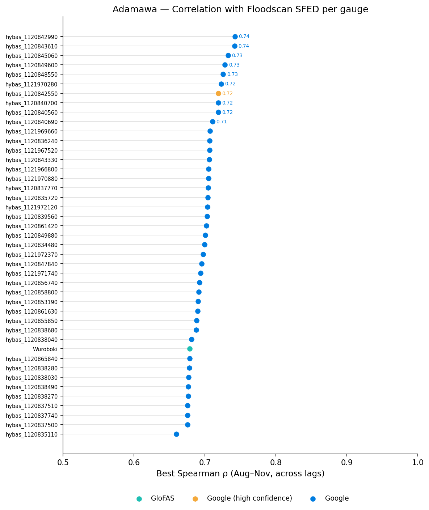

---

## Gauge selection

<!-- markdownlint-disable MD033 -->

The top 10 gauges by Spearman ρ were retained from the combined GRRR and GloFAS candidate pool — the selection is purely performance-based with no source-level filtering. In Adamawa, all 10 happen to be GRRR gauges: the GloFAS station at Wuroboki ranked just below the cutoff (ρ ≈ 0.68) against the top GRRR gauges (ρ ≈ 0.71–0.74). Nine of the ten are tightly clustered around 9.3–9.4°N, 12.3–12.9°E on the main Benue channel (best ρ ≈ 0.71–0.74, lag = −3 days). The tenth, hybas_1120840690, is a clear outlier: its 4-year empirical RP threshold is 143 m³/s — roughly 8× lower than the others (~1,100 m³/s) — it peaks 2 days *after* the Floodscan peak, and it contributed to only 4 of the 6 action trigger years. It likely represents a small tributary rather than the main channel. It was retained in the gauge pool because a single anomalous gauge cannot dominate the ≥60% voting rule, but it warrants attention in any future gauge set review.

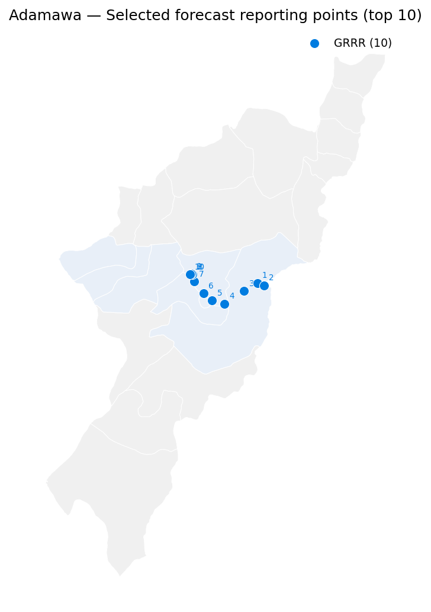{width=100%}

<!-- markdownlint-enable MD033 -->

---

## Action trigger design

A grid search was run over two parameters: the per-gauge return period threshold (2–5 yr) and the minimum number of gauges required to fire simultaneously on the same wet-season day (2–10). For each combination, trigger fire years were counted and scored against Floodscan event years using POD, FPR, and F1.

The selected configuration is: **≥ 6 of 10 gauges simultaneously exceed their individual 4-year empirical Weibull RP threshold on at least one wet-season day.** Empirical 4-year thresholds range from 1,101 to 1,117 m³/s across the main-channel gauges (and 143 m³/s for the outlier). The ≥6/10 requirement (60%) balances spatial corroboration against sensitivity: lower fractions pick up isolated gauge noise, higher fractions miss events where flooding is spatially concentrated.

Over the full reanalysis period 1998–2023, the trigger fires in: **1998, 1999, 2012, 2018, 2019, 2022** — giving a combined Weibull RP of **4.5 years** (n = 26, k = 6), well-matched to the 4-year RP design target.

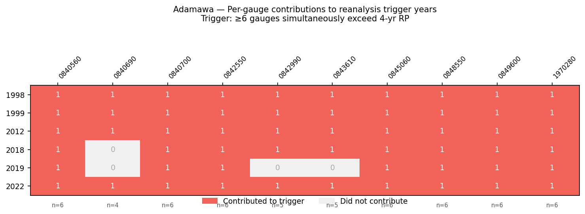

---

## Comparison with the 2025 trigger

The two triggers differ in exactly one year each. The 2025 trigger fires in 2003 (a 3-year Floodscan event, not a 4-year event) but not in 2018. The 2026 trigger fires in 2018 (a genuine 4-year Floodscan event) but not in 2003. This directly reflects the design target shift from 5-year RP (2025) to 4-year RP (2026).

The improvement is concentrated at the 4-year RP benchmark (POD: 50% → 67%, F1: 0.50 → 0.67); performance at 3-year and 5-year levels is identical across both designs. Both miss 2015 and 2023, which are genuine 4–5-year flood years not captured by either design.

The 2026 design trades the 2025 trigger's two-model redundancy (GloFAS + GRRR) for spatial redundancy within a single model (10 geographically distributed GRRR gauges). This makes it more robust to local gauge noise but removes GloFAS as an independent cross-check. The GRRR reforecast horizon (≤7 days) is also shorter than GloFAS's, constraining maximum early warning from the action trigger alone — which is why a separate readiness trigger was developed.

---

## Readiness trigger

The readiness trigger uses the GloFAS ensemble reforecast at Wuroboki, evaluated over 2003–2022 (n = 20 years). A year fires if the ensemble mean exceeds the discharge threshold at any lead time within the maximum lead time window (Aug–Nov). The discharge threshold is fixed at the 2025 value of **3,132 m³/s** (~5-year GloFAS reanalysis RP), which sits above the 4-year reanalysis RP (3,009 m³/s) to reduce false alarms. Two lead time configurations were evaluated:

- **Option A — 3,132 m³/s, LT ≤ 13 days:** fires in 2003, 2008, 2012, 2014, 2016, 2019, 2022 (k = 7, RP = 3.0 yr). POD = 3/4 action years (misses 2018). Lead times vs action trigger: 2012 +2d, 2019 +46d, 2022 +13d.
- **Option B — 3,250 m³/s, LT ≤ 12 days:** fires in 2003, 2014, 2016, 2019, 2022 (k = 6, RP = 3.5 yr). POD = 2/4 (misses 2012 and 2018). Lead times vs action trigger: 2012 −15d (fires after), 2019 +46d, 2022 +3d. The higher threshold means the GloFAS signal in 2012 (max 3,142 m³/s) never crosses the bar.

**Option A (3,132 m³/s, LT ≤ 13d) was selected.** The +2d lead in 2012 is operationally marginal (GloFAS peaks only 3,142 m³/s at LT=1d, meaning any higher threshold misses 2012 entirely), but Option A is preferable to Option B because it avoids a retroactive trigger in 2012. Both options fail to detect 2018; extending to LT ≤ 16d detects 2018 but adds a new false positive in 2010 and shortens the combined RP to 2.3 years — an unacceptable activation frequency. The GloFAS reforecast appears to have systematically underforecast the 2018 event at short lead times, which cannot be resolved by threshold or lead time adjustment alone.

The readiness trigger fires approximately once every 3 years, compared to the action trigger's once every 4.5 years. Roughly 4 readiness activations per 20 years will not be followed by an action trigger activation. This frequency is financially acceptable at 5% pre-positioning cost but should be communicated clearly to partners.

---

## Framework update for 2026

This section summarises the 2026 design in the format of the endorsed 2025 AA Framework document, to support updating the PDF.

### Trigger definitions

**2025 action trigger (endorsed Aug 2025):**

- GloFAS: ensemble mean discharge ≥ 3,132 m³/s at Wuroboki (G5004) within next 5 days
- OR Google GRRR: discharge ≥ 1,195 m³/s at Kangli (hybas\_1120842550) at any point in wet season

**2026 action trigger (revised):**

- Google GRRR: ≥ 6 of 10 gauges simultaneously exceed their individual 4-year empirical RP threshold on the same wet-season day
- Individual threshold: approximately 1,100–1,117 m³/s at each of 9 main-channel gauges; 143 m³/s at outlier gauge hybas\_1120840690
- The single-station Google condition at Kangli is replaced by a spatially distributed multi-gauge voting rule. GloFAS is moved to a separate, independent readiness trigger.

**2026 readiness trigger (new — not in 2025 framework):**

- GloFAS ensemble mean > 3,132 m³/s at Wuroboki within lead time ≤ 13 days
- Designed to fire ahead of the action trigger and enable pre-positioning

### Historical event and trigger year overview

The heatmap below shows Floodscan flood event years and trigger activation years across the full evaluation period (1998–2023 for the action trigger; 2003–2022 for the readiness trigger). Numbers in trigger rows indicate lead time in days relative to the first Floodscan ≥4-yr RP exceedance that season (positive = trigger fired before flood; shown only in years where Floodscan reached ≥4-yr RP).

<!-- markdownlint-disable MD033 -->

<table class="heatmap">
<thead><tr>
<th class="heatmap-label"></th>
<th class="heatmap-year">1998</th>
<th class="heatmap-year">1999</th>
<th class="heatmap-year">2000</th>
<th class="heatmap-year">2001</th>
<th class="heatmap-year">2002</th>
<th class="heatmap-year">2003</th>
<th class="heatmap-year">2004</th>
<th class="heatmap-year">2005</th>
<th class="heatmap-year">2006</th>
<th class="heatmap-year">2007</th>
<th class="heatmap-year">2008</th>
<th class="heatmap-year">2009</th>
<th class="heatmap-year">2010</th>
<th class="heatmap-year">2011</th>
<th class="heatmap-year">2012</th>
<th class="heatmap-year">2013</th>
<th class="heatmap-year">2014</th>
<th class="heatmap-year">2015</th>
<th class="heatmap-year">2016</th>
<th class="heatmap-year">2017</th>
<th class="heatmap-year">2018</th>
<th class="heatmap-year">2019</th>
<th class="heatmap-year">2020</th>
<th class="heatmap-year">2021</th>
<th class="heatmap-year">2022</th>
<th class="heatmap-year">2023</th>
</tr></thead>
<tbody>
<tr>
<td class="heatmap-label">Floodscan ≥3-yr RP</td>
<td class="heatmap-cell" style="background:#4A90E2" title="1998"></td>
<td class="heatmap-cell" style="background:#4A90E2" title="1999"></td>
<td class="heatmap-cell" style="background:#eef1f4" title="2000"></td>
<td class="heatmap-cell" style="background:#eef1f4" title="2001"></td>
<td class="heatmap-cell" style="background:#eef1f4" title="2002"></td>
<td class="heatmap-cell" style="background:#4A90E2" title="2003"></td>
<td class="heatmap-cell" style="background:#eef1f4" title="2004"></td>
<td class="heatmap-cell" style="background:#eef1f4" title="2005"></td>
<td class="heatmap-cell" style="background:#eef1f4" title="2006"></td>
<td class="heatmap-cell" style="background:#eef1f4" title="2007"></td>
<td class="heatmap-cell" style="background:#eef1f4" title="2008"></td>
<td class="heatmap-cell" style="background:#eef1f4" title="2009"></td>
<td class="heatmap-cell" style="background:#eef1f4" title="2010"></td>
<td class="heatmap-cell" style="background:#eef1f4" title="2011"></td>
<td class="heatmap-cell" style="background:#4A90E2" title="2012"></td>
<td class="heatmap-cell" style="background:#eef1f4" title="2013"></td>
<td class="heatmap-cell" style="background:#eef1f4" title="2014"></td>
<td class="heatmap-cell" style="background:#4A90E2" title="2015"></td>
<td class="heatmap-cell" style="background:#eef1f4" title="2016"></td>
<td class="heatmap-cell" style="background:#eef1f4" title="2017"></td>
<td class="heatmap-cell" style="background:#4A90E2" title="2018"></td>
<td class="heatmap-cell" style="background:#4A90E2" title="2019"></td>
<td class="heatmap-cell" style="background:#eef1f4" title="2020"></td>
<td class="heatmap-cell" style="background:#eef1f4" title="2021"></td>
<td class="heatmap-cell" style="background:#4A90E2" title="2022"></td>
<td class="heatmap-cell" style="background:#4A90E2" title="2023"></td>
</tr>
<tr>
<td class="heatmap-label">Floodscan ≥4-yr RP</td>
<td class="heatmap-cell" style="background:#eef1f4" title="1998"></td>
<td class="heatmap-cell" style="background:#007CE0" title="1999"></td>
<td class="heatmap-cell" style="background:#eef1f4" title="2000"></td>
<td class="heatmap-cell" style="background:#eef1f4" title="2001"></td>
<td class="heatmap-cell" style="background:#eef1f4" title="2002"></td>
<td class="heatmap-cell" style="background:#eef1f4" title="2003"></td>
<td class="heatmap-cell" style="background:#eef1f4" title="2004"></td>
<td class="heatmap-cell" style="background:#eef1f4" title="2005"></td>
<td class="heatmap-cell" style="background:#eef1f4" title="2006"></td>
<td class="heatmap-cell" style="background:#eef1f4" title="2007"></td>
<td class="heatmap-cell" style="background:#eef1f4" title="2008"></td>
<td class="heatmap-cell" style="background:#eef1f4" title="2009"></td>
<td class="heatmap-cell" style="background:#eef1f4" title="2010"></td>
<td class="heatmap-cell" style="background:#eef1f4" title="2011"></td>
<td class="heatmap-cell" style="background:#007CE0" title="2012"></td>
<td class="heatmap-cell" style="background:#eef1f4" title="2013"></td>
<td class="heatmap-cell" style="background:#eef1f4" title="2014"></td>
<td class="heatmap-cell" style="background:#007CE0" title="2015"></td>
<td class="heatmap-cell" style="background:#eef1f4" title="2016"></td>
<td class="heatmap-cell" style="background:#eef1f4" title="2017"></td>
<td class="heatmap-cell" style="background:#007CE0" title="2018"></td>
<td class="heatmap-cell" style="background:#eef1f4" title="2019"></td>
<td class="heatmap-cell" style="background:#eef1f4" title="2020"></td>
<td class="heatmap-cell" style="background:#eef1f4" title="2021"></td>
<td class="heatmap-cell" style="background:#007CE0" title="2022"></td>
<td class="heatmap-cell" style="background:#007CE0" title="2023"></td>
</tr>
<tr>
<td class="heatmap-label">Floodscan ≥5-yr RP</td>
<td class="heatmap-cell" style="background:#eef1f4" title="1998"></td>
<td class="heatmap-cell" style="background:#1E5A8E" title="1999"></td>
<td class="heatmap-cell" style="background:#eef1f4" title="2000"></td>
<td class="heatmap-cell" style="background:#eef1f4" title="2001"></td>
<td class="heatmap-cell" style="background:#eef1f4" title="2002"></td>
<td class="heatmap-cell" style="background:#eef1f4" title="2003"></td>
<td class="heatmap-cell" style="background:#eef1f4" title="2004"></td>
<td class="heatmap-cell" style="background:#eef1f4" title="2005"></td>
<td class="heatmap-cell" style="background:#eef1f4" title="2006"></td>
<td class="heatmap-cell" style="background:#eef1f4" title="2007"></td>
<td class="heatmap-cell" style="background:#eef1f4" title="2008"></td>
<td class="heatmap-cell" style="background:#eef1f4" title="2009"></td>
<td class="heatmap-cell" style="background:#eef1f4" title="2010"></td>
<td class="heatmap-cell" style="background:#eef1f4" title="2011"></td>
<td class="heatmap-cell" style="background:#1E5A8E" title="2012"></td>
<td class="heatmap-cell" style="background:#eef1f4" title="2013"></td>
<td class="heatmap-cell" style="background:#eef1f4" title="2014"></td>
<td class="heatmap-cell" style="background:#1E5A8E" title="2015"></td>
<td class="heatmap-cell" style="background:#eef1f4" title="2016"></td>
<td class="heatmap-cell" style="background:#eef1f4" title="2017"></td>
<td class="heatmap-cell" style="background:#eef1f4" title="2018"></td>
<td class="heatmap-cell" style="background:#eef1f4" title="2019"></td>
<td class="heatmap-cell" style="background:#eef1f4" title="2020"></td>
<td class="heatmap-cell" style="background:#eef1f4" title="2021"></td>
<td class="heatmap-cell" style="background:#1E5A8E" title="2022"></td>
<td class="heatmap-cell" style="background:#1E5A8E" title="2023"></td>
</tr>
<tr class="heatmap-spacer"><td colspan="27"></td></tr>
<tr>
<td class="heatmap-label">Action trigger (2026)</td>
<td class="heatmap-cell" style="background:#F2645A" title="1998"></td>
<td class="heatmap-cell" style="background:#F2645A" title="1999"></td>
<td class="heatmap-cell" style="background:#eef1f4" title="2000"></td>
<td class="heatmap-cell" style="background:#eef1f4" title="2001"></td>
<td class="heatmap-cell" style="background:#eef1f4" title="2002"></td>
<td class="heatmap-cell" style="background:#eef1f4" title="2003"></td>
<td class="heatmap-cell" style="background:#eef1f4" title="2004"></td>
<td class="heatmap-cell" style="background:#eef1f4" title="2005"></td>
<td class="heatmap-cell" style="background:#eef1f4" title="2006"></td>
<td class="heatmap-cell" style="background:#eef1f4" title="2007"></td>
<td class="heatmap-cell" style="background:#eef1f4" title="2008"></td>
<td class="heatmap-cell" style="background:#eef1f4" title="2009"></td>
<td class="heatmap-cell" style="background:#eef1f4" title="2010"></td>
<td class="heatmap-cell" style="background:#eef1f4" title="2011"></td>
<td class="heatmap-cell" style="background:#F2645A" title="2012"></td>
<td class="heatmap-cell" style="background:#eef1f4" title="2013"></td>
<td class="heatmap-cell" style="background:#eef1f4" title="2014"></td>
<td class="heatmap-cell" style="background:#eef1f4" title="2015"></td>
<td class="heatmap-cell" style="background:#eef1f4" title="2016"></td>
<td class="heatmap-cell" style="background:#eef1f4" title="2017"></td>
<td class="heatmap-cell" style="background:#F2645A" title="2018"></td>
<td class="heatmap-cell" style="background:#F2645A" title="2019"></td>
<td class="heatmap-cell" style="background:#eef1f4" title="2020"></td>
<td class="heatmap-cell" style="background:#eef1f4" title="2021"></td>
<td class="heatmap-cell" style="background:#F2645A" title="2022"></td>
<td class="heatmap-cell" style="background:#eef1f4" title="2023"></td>
</tr>
<tr>
<td class="heatmap-label">Readiness trigger (A)</td>
<td class="heatmap-cell" style="background:#d8dde3" title="1998"></td>
<td class="heatmap-cell" style="background:#d8dde3" title="1999"></td>
<td class="heatmap-cell" style="background:#d8dde3" title="2000"></td>
<td class="heatmap-cell" style="background:#d8dde3" title="2001"></td>
<td class="heatmap-cell" style="background:#d8dde3" title="2002"></td>
<td class="heatmap-cell" style="background:#1EBFB3" title="2003"></td>
<td class="heatmap-cell" style="background:#eef1f4" title="2004"></td>
<td class="heatmap-cell" style="background:#eef1f4" title="2005"></td>
<td class="heatmap-cell" style="background:#eef1f4" title="2006"></td>
<td class="heatmap-cell" style="background:#eef1f4" title="2007"></td>
<td class="heatmap-cell" style="background:#1EBFB3" title="2008"></td>
<td class="heatmap-cell" style="background:#eef1f4" title="2009"></td>
<td class="heatmap-cell" style="background:#eef1f4" title="2010"></td>
<td class="heatmap-cell" style="background:#eef1f4" title="2011"></td>
<td class="heatmap-cell" style="background:#1EBFB3" title="2012"></td>
<td class="heatmap-cell" style="background:#eef1f4" title="2013"></td>
<td class="heatmap-cell" style="background:#1EBFB3" title="2014"></td>
<td class="heatmap-cell" style="background:#eef1f4" title="2015"></td>
<td class="heatmap-cell" style="background:#1EBFB3" title="2016"></td>
<td class="heatmap-cell" style="background:#eef1f4" title="2017"></td>
<td class="heatmap-cell" style="background:#eef1f4" title="2018"></td>
<td class="heatmap-cell" style="background:#1EBFB3" title="2019"></td>
<td class="heatmap-cell" style="background:#eef1f4" title="2020"></td>
<td class="heatmap-cell" style="background:#eef1f4" title="2021"></td>
<td class="heatmap-cell" style="background:#1EBFB3" title="2022"></td>
<td class="heatmap-cell" style="background:#d8dde3" title="2023"></td>
</tr>
</tbody>
</table>

Floodscan ≥3-yr RP
Floodscan ≥4-yr RP
Floodscan ≥5-yr RP
Action trigger fired
Readiness trigger fired
Outside eval. period

Coloured cells indicate trigger activation (action trigger: coral; readiness trigger: teal). Floodscan flood event years are shown at three RP levels. Grey cells in the readiness row indicate years outside the GloFAS reforecast evaluation period (2003–2022). Lead time detail is in the Trigger timing performance section below.

<!-- markdownlint-enable MD033 -->

### Action trigger gauge thresholds

The action trigger fires if **≥ 6 of the 10 gauges below** simultaneously exceed their individual 4-year empirical RP threshold on the same wet-season day. Thresholds were estimated using Weibull plotting positions on wet-season annual maxima, 1998–2023. Gauges are ordered by Spearman ρ (descending); all are GRRR source.

| Gauge ID | Latitude | Longitude | Spearman ρ | 4-yr RP threshold (m³/s) | Trigger years contributed (of 6) |
|---|---|---|---|---|---|
| hybas\_1120842990 | 9.39°N | 12.81°E | 0.742 | 1,111 | 5 |
| hybas\_1120843610 | 9.37°N | 12.85°E | 0.742 | 1,102 | 5 |
| hybas\_1120845060 | 9.33°N | 12.71°E | 0.732 | 1,102 | 6 |
| hybas\_1120849600 | 9.24°N | 12.58°E | 0.728 | 1,114 | 6 |
| hybas\_1120848550 | 9.26°N | 12.49°E | 0.726 | 1,106 | 6 |
| hybas\_1121970280 | 9.31°N | 12.44°E | 0.723 | 1,110 | 6 |
| hybas\_1120842550 *(Kangli)* | 9.39°N | 12.37°E | 0.719 | 1,114 | 6 |
| hybas\_1120840700 | 9.44°N | 12.36°E | 0.719 | 1,113 | 6 |
| hybas\_1120840560 | 9.45°N | 12.35°E | 0.719 | 1,117 | 6 |
| hybas\_1120840690 *(outlier — small tributary)* | 9.44°N | 12.34°E | 0.711 | 143 | 4 |

hybas\_1120840690 has a substantially lower threshold (143 m³/s vs ~1,100 m³/s for the main-channel gauges) and contributed to only 4 of 6 trigger years. It is retained in the pool because a single anomalous gauge cannot dominate the ≥6/10 voting rule.

---

### Performance summary

The 2026 action trigger was explicitly designed to preserve the **same activation frequency as 2025** — both fire 6 times in 26 reanalysis years (RP = 4.5 yr, 22% annual probability). The revision changes *which* years fire, improving alignment with the 4-year RP design target without altering the intervention frequency expected by the AA framework.

| | 2025 (endorsed) | 2026 (revised) |
|---|---|---|
| Action trigger RP | 4.5 years | 4.5 years |
| Annual activation probability | 22% | 22% |
| Fire years (reanalysis, 1998–2023) | 1998, 1999, 2003, 2012, 2019, 2022 | 1998, 1999, 2012, 2018, 2019, 2022 |
| Detection rate (POD) at 4-yr RP | 50%† | **67%** |
| FAR at 4-yr RP | 15%† | **10%** |
| F1 at 4-yr RP | 50%† | **67%** |
| Readiness trigger RP | — | ~3 years |
| Readiness fire years (2003–2022) | — | 2003, 2008, 2012, 2014, 2016, 2019, 2022 |

Accuracy evaluated against Floodscan SFED annual maxima, 1998–2023 (n = 26 years) at the **4-year RP** design target. FAR = FP / (FP + TN). At 3-yr and 5-yr RP benchmarks, both triggers perform identically.

† 2025 4-yr metrics computed here on the same 1998–2023 period for direct comparability; 2025 figures at 3-yr and 5-yr RP are from the endorsed framework PDF and may reflect a different evaluation period.

**Small sample caveat:** With only 6 positive events at the 4-yr RP level, each individual year shifts POD and F1 by ~17 percentage points. All metrics should be treated as indicative rather than statistically robust.

### Readiness trigger performance

Readiness trigger configuration: **GloFAS ensemble mean > 3,132 m³/s at Wuroboki (G5004), lead time ≤ 13 days**. Evaluated over 2003–2022 (n = 20 complete reforecast years), benchmarked against the 2026 action trigger fire years within that window: {2012, 2018, 2019, 2022}.

| Metric | Value |
|---|---|
| Evaluation period | 2003–2022 (n = 20 years) |
| Benchmark | 2026 action trigger years in window: {2012, 2018, 2019, 2022} |
| TP — readiness fires, action fires | 3 (2012, 2019, 2022) |
| FP — readiness fires, no action | 4 (2003, 2008, 2014, 2016) |
| FN — readiness misses, action fires | 1 (2018) |
| TN — neither fires | 12 |
| Detection rate (POD) | 75% |
| False alarm rate (FAR = FP / FP+TN) | 25% |
| Precision | 43% |
| F1 | 55% |
| Activation return period | ~3 years |

Lead times ahead of the action trigger were +2d (2012), +46d (2019), and +13d (2022). The 2019 figure reflects an unusually early GloFAS signal; the operationally expected window is 2–13 days. Full lead time detail relative to flood onset is in the Trigger timing performance section below. The 2018 miss cannot be resolved by threshold or lead time adjustment — the GloFAS ensemble systematically underforecast the 2018 event at all short lead times.

**Small sample caveat:** The readiness trigger is benchmarked against only 4 action trigger years in the 2003–2022 evaluation window. Each year shifts POD by 25 percentage points; the 75% POD figure rests on 3 detections out of 4 opportunities and should not be read as a stable estimate of operational reliability.

### Trigger timing performance

Timing is measured relative to two reference dates per event year: (1) the **first day Floodscan SFED exceeds the 4-year RP threshold** ("RP exceedance"), and (2) the **Floodscan wet-season annual maximum** ("seasonal peak"). Positive lead = trigger fired before the reference date.

**Small sample caveat:** Lead times are observed in at most 4 event years for the action trigger and 2 years for the readiness trigger. Single outlier years (e.g. 1999's +41d reanalysis lead) substantially affect any summary statistic. Ranges and individual year values are more meaningful than averages here.

#### Action trigger

Lead times are from the **GRRR reanalysis** (historical proxy). The GRRR reforecast adds approximately **+5 days** of advance warning — estimated operational lead times (reanalysis lead + 5d) are shown in the final two columns. These are illustrative estimates: in practice, reforecast lead will vary by year depending on how quickly the upstream flood signal develops.

| Year | Reanalysis fires | FS 4yr RP first crosses | Lead to RP | Lead to RP (est. +5d) | FS annual peak | Lead to peak | Lead to peak (est. +5d) |
|---|---|---|---|---|---|---|---|
| 1999 | 7 Sep | 18 Oct | +41d | **+46d** | 21 Oct | +44d | **+49d** |
| 2012 | 23 Aug | 23 Aug | 0d | **+5d** | 21 Sep | +29d | **+34d** |
| 2015 | — | 1 Sep | *miss* | — | 5 Sep | *miss* | — |
| 2018 | 13 Sep | 12 Sep | −1d | **+4d** | 12 Sep | −1d | **+4d** |
| 2022 | 3 Sep | 28 Aug | −6d | **−1d** | 21 Sep | +18d | **+23d** |
| 2023 | — | 6 Oct | *miss* | — | 9 Oct | *miss* | — |

Excluding the atypical 1999 season (an early upstream signal 41 days before RP exceedance), the GRRR reanalysis fires at roughly the same time the flood threshold is first crossed (0 to −6 days). With the +5d reforecast offset, the estimated operational lead to the 4yr RP crossing is **+4 to +5 days** (2012, 2018) or approximately −1 day in 2022 (flood rose unusually fast). Lead time to the **seasonal flood peak** is substantially longer — **+18 to +29 days** in reanalysis, estimated **+23 to +34 days** operationally — because the flood continues rising for weeks after the initial RP threshold crossing. In 2022 specifically, the action trigger fires 6 days after the flood first exceeds the threshold, yet the peak is still 18 days away — illustrating that "late to the RP crossing" does not mean "late to the peak."

#### Readiness trigger (GloFAS reforecast)

Lead times are from the **GloFAS reforecast first fire date** (first issue date with ensemble mean > 3,132 m³/s at LT ≤ 13d). Evaluated against Floodscan 4-year RP event years only.

| Year | Readiness fires | Lead to RP exceedance | Lead to action trigger | Lead to annual peak | Notes |
|---|---|---|---|---|---|
| 2012 | 21 Aug | +2d | +2d | +31d | TP — both triggers fire |
| 2018 | — | — | — | — | FN — GloFAS underforecast at LT ≤ 13d |
| 2022 | 21 Aug | +7d | +13d | +31d | TP — readiness fires 13d before action |

In both detected years the readiness trigger fires on 21 August, providing **2–7 days** ahead of the 4yr RP exceedance, **2–13 days** ahead of the action trigger, and **31 days** ahead of the seasonal flood peak. No forecast offset is added here — the GloFAS reforecast is already an operational forecast product. The 2018 miss is irreducible within the LT ≤ 13d constraint.

### Year-by-year peak timing

Per-event detail plots showing Floodscan SFED (amber), GloFAS reanalysis (blue), individual GRRR gauge series normalised to each gauge's 4-year RP threshold (coral), and trigger activation markers. Vertical lines mark: ≥60% GRRR gauges threshold (coral dashed), Floodscan RP exceedance (amber dashed), and GloFAS readiness trigger issue date (teal). A news event timeline is shown below each plot.

<!-- markdownlint-disable MD033 -->

#### Floodscan ≥4-yr RP event years

1999 — Floodscan ≥4-yr RP event · Action trigger TP (+41d to RP) · Readiness: outside eval. period

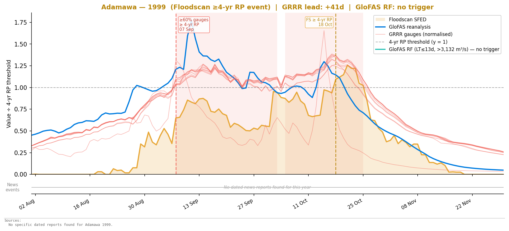{width=100%}

2012 — Floodscan ≥4-yr RP event · Action trigger TP (0d to RP) · Readiness TP (+2d to RP)

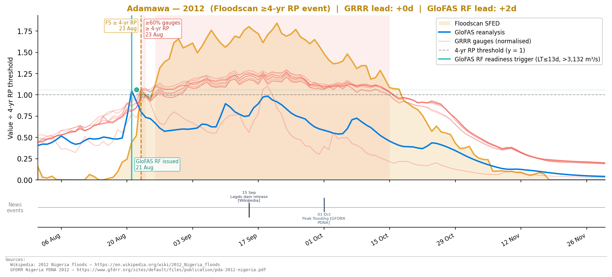{width=100%}

2015 — Floodscan ≥4-yr RP event · Both triggers missed

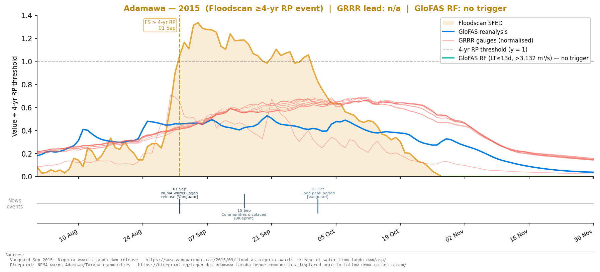{width=100%}

2018 — Floodscan ≥4-yr RP event · Action trigger TP (−1d to RP) · Readiness missed

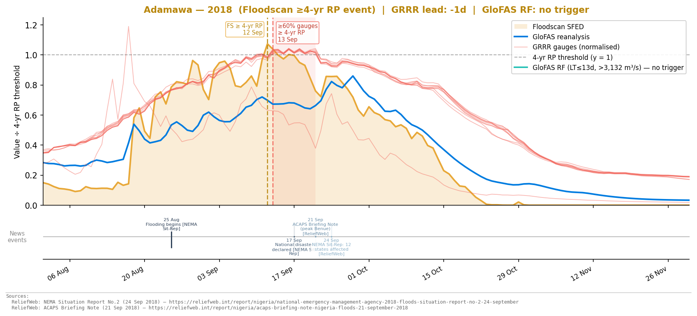{width=100%}

2022 — Floodscan ≥4-yr RP event · Action trigger TP (−6d to RP, +18d to peak) · Readiness TP (+7d to RP)

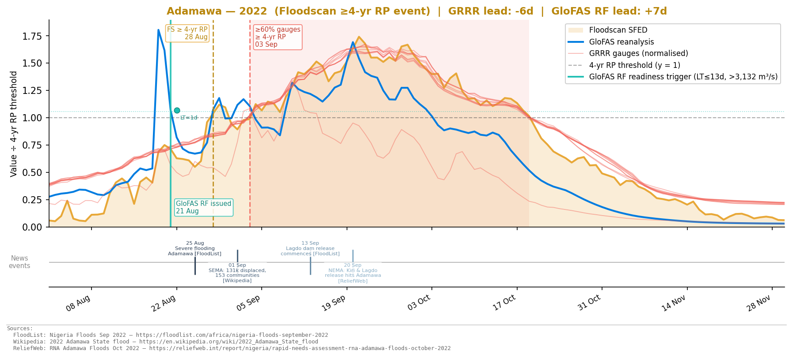{width=100%}

2023 — Floodscan ≥4-yr RP event · Both triggers missed

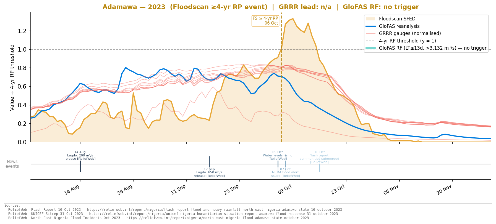{width=100%}

#### Action trigger false positive years

1998 — GRRR fires (false positive against 4-yr RP) · No Floodscan ≥4-yr RP event

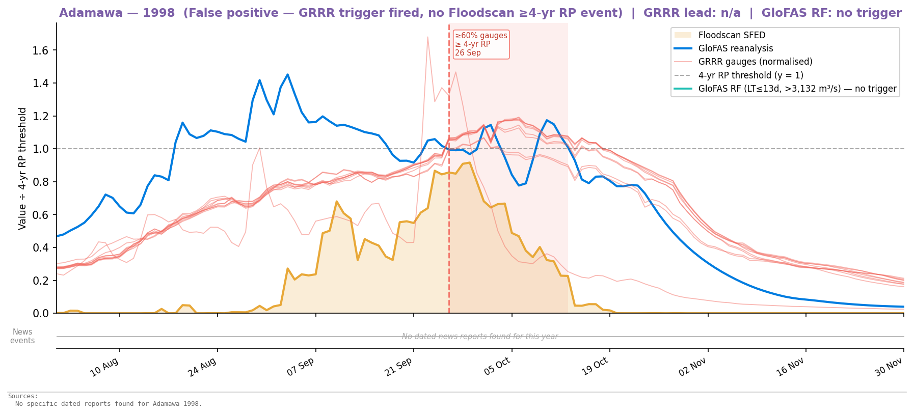{width=100%}

2019 — GRRR fires (false positive against 4-yr RP) · No Floodscan ≥4-yr RP event · Readiness also fires

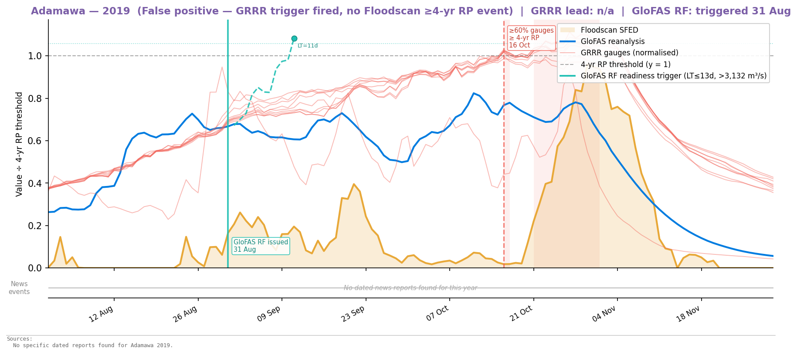{width=100%}

#### Readiness trigger only years

2003 — Readiness trigger fires (GloFAS false positive)

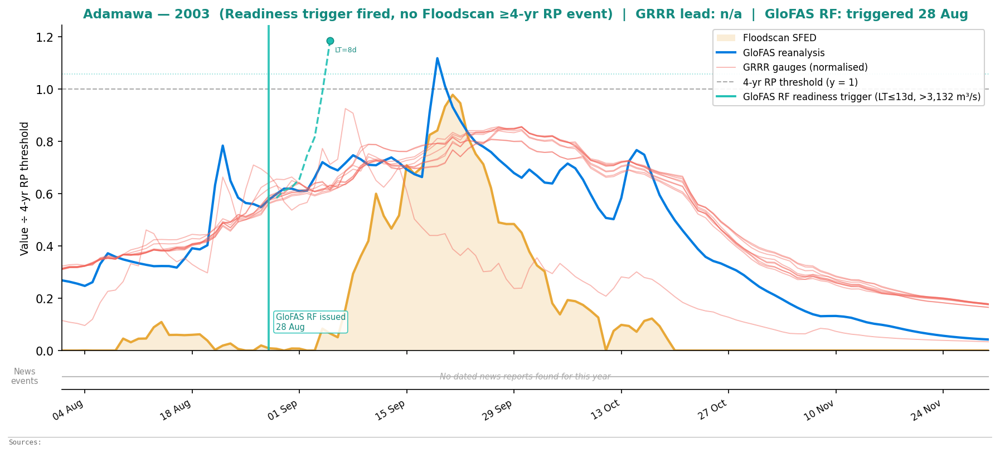{width=100%}

2008 — Readiness trigger fires (GloFAS false positive)

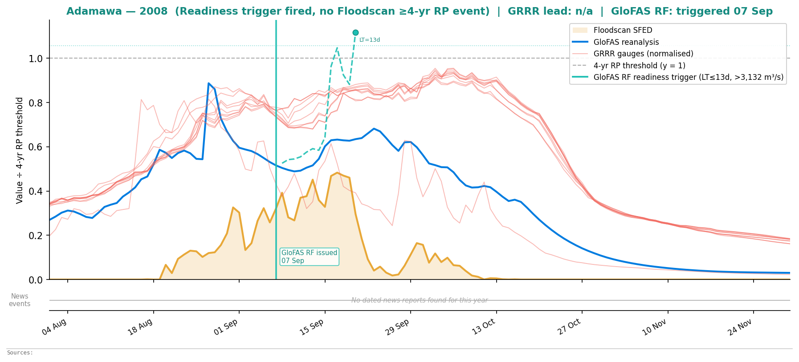{width=100%}

2014 — Readiness trigger fires (GloFAS false positive)

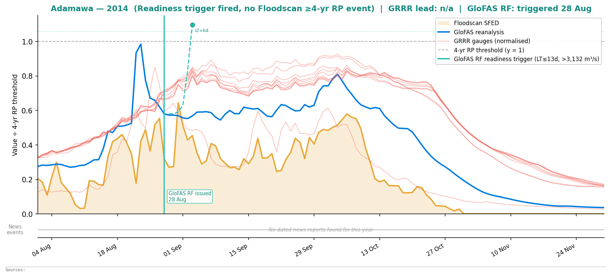{width=100%}

2016 — Readiness trigger fires (GloFAS false positive)

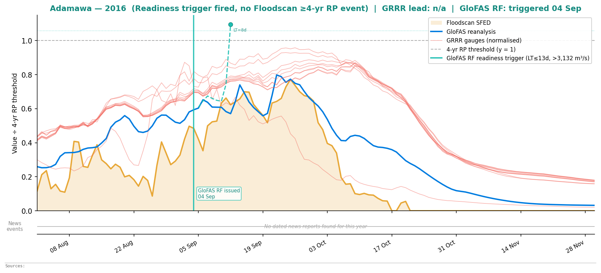{width=100%}

<!-- markdownlint-enable MD033 -->

---

### Summary of 2026 improvements

The 2026 action trigger replaces the 2025 dual-model OR design (GloFAS at Wuroboki OR GRRR at Kangli) with a spatially distributed consensus condition within a single model: at least 6 of 10 upstream GRRR gauges must simultaneously exceed their individual 4-year empirical RP threshold. This corrects the main weakness of the 2025 design: the 2025 trigger missed the 2018 Floodscan event (a genuine ≥4-year flood year) while firing in 2003 (a 3-year event below the intended design threshold). The 2026 trigger fires in 2018 and not in 2003, improving F1 at the 4-year benchmark from 0.50 to 0.67. The trigger's overall return period (4.5 years) and activation frequency (22%) are unchanged.

A new readiness trigger is introduced — absent from the 2025 framework — using the GloFAS ensemble reforecast at Wuroboki (> 3,132 m³/s, lead time ≤ 13 days). It fires approximately every 3 years and detected 3 of 4 action trigger years in the 2003–2022 evaluation window at lead times of 2–13 days, enabling pre-positioning decisions ahead of the GRRR-based action trigger. The 2025 GloFAS component — which used reanalysis, not reforecast, and had no explicit lead time requirement — was not suitable as a readiness trigger in the operational sense; the 2026 design makes this preparedness function explicit and independently evaluable.

---

## What was not resolved

**GloFAS reanalysis as a supplementary readiness component** was evaluated and not recommended. Adding a condition that fires if the GloFAS ERA5 reanalysis exceeds 3,132 m³/s (as a near-real-time nowcast proxy) produces no additional event detections within the 2003–2022 evaluation window — the reanalysis only adds 2022 and 2003, both already captured by the reforecast component — and provides only a 2-day earlier signal in 2022. Its main theoretical value is as a safety net for years where the reforecast fails, but realising this benefit would require a reliable near-real-time GloFAS data feed that is not currently operational in this workflow.

**2015 and 2023 remain unexplained misses.** Both are genuine 4–5-year Floodscan events that neither trigger configuration detects. Whether this reflects a different flood pathway (e.g. Lagdo dam release timing, upper Benue vs tributary contributions), gaps in GRRR gauge coverage for those years, or a model deficiency is not yet determined. Investigating these years is a priority before operational deployment.

**Benue state** trigger thresholds were not finalised. Notebooks `05_trigger_assessment.ipynb` and `06_trigger_definition.ipynb` are ready to run with `STATE = "Benue"`, but the optimal RP threshold and gauge count for Makurdi remain unconfirmed in `STATE_CONFIG`. The same workflow applies directly to Benue once these values are calibrated.
